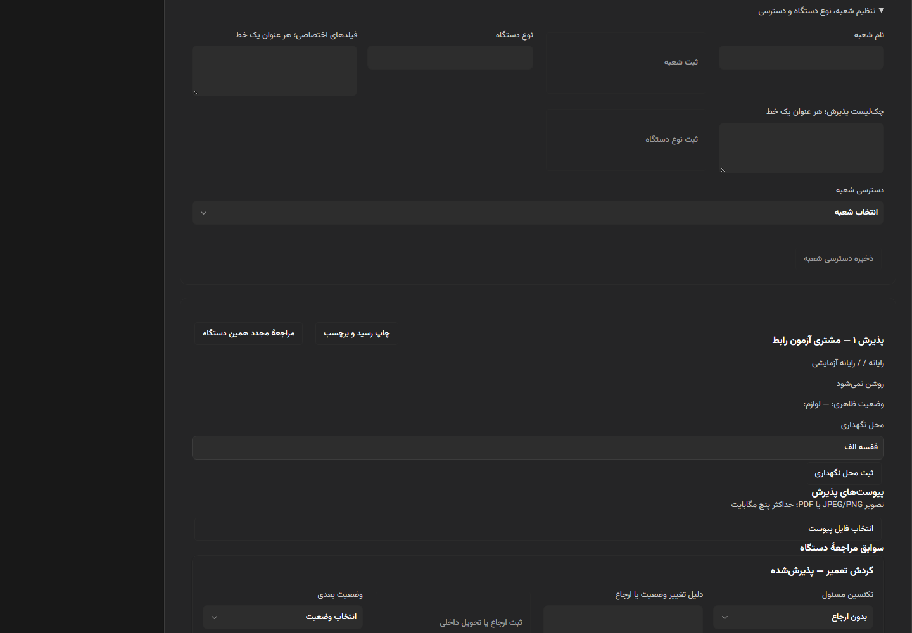
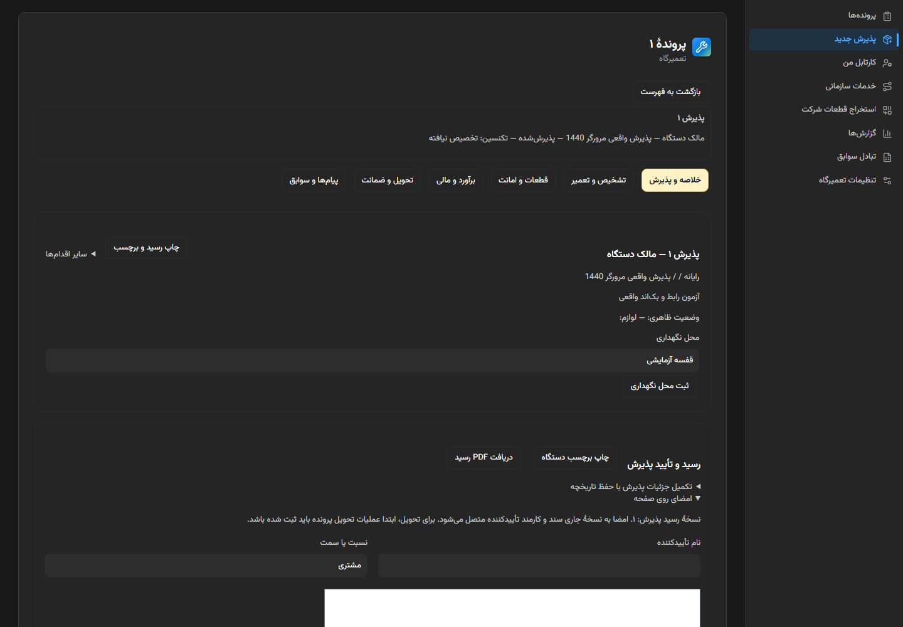
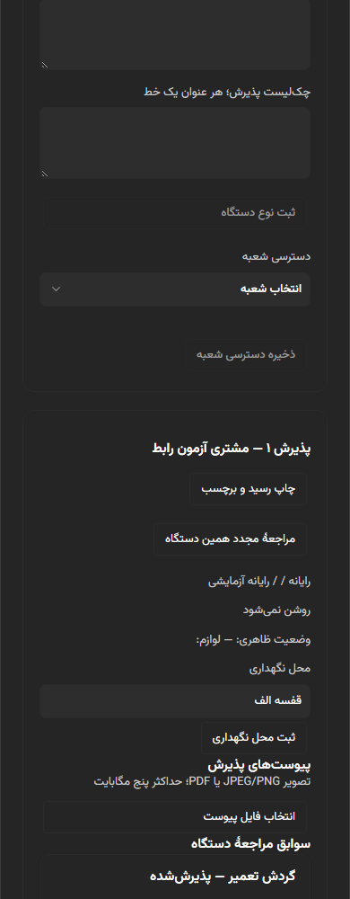
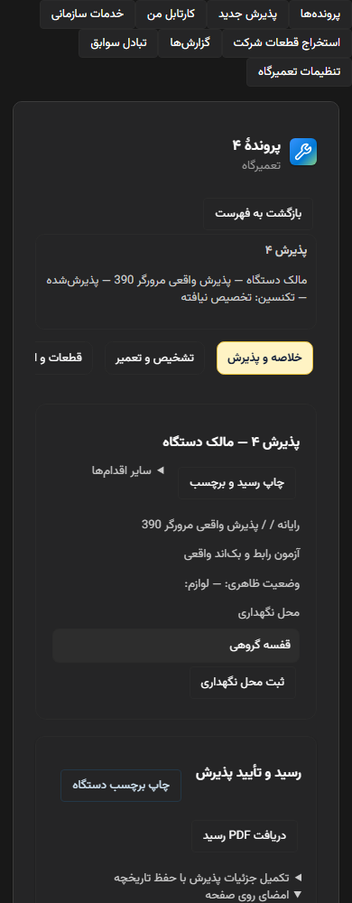
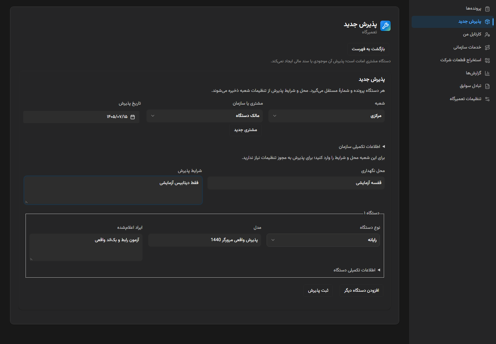
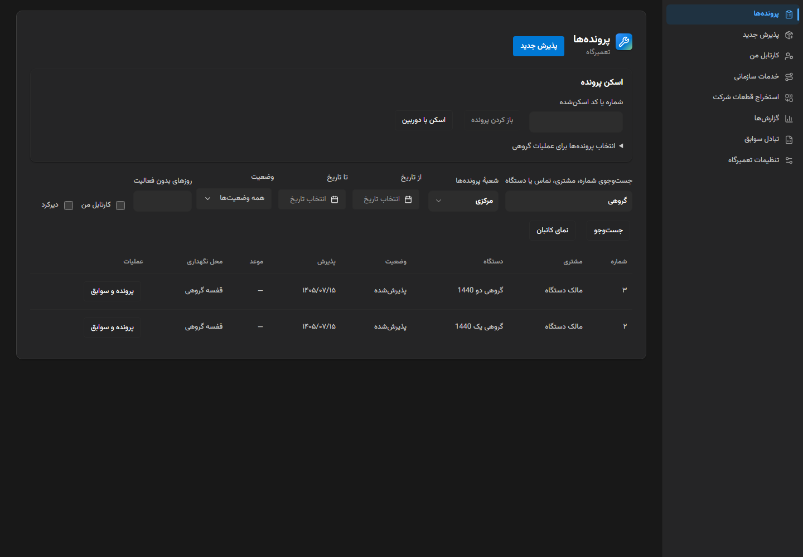

# تحویل ساده‌سازی تعمیرگاه — ۱.۹.۱۵

ورود به تعمیرگاه اکنون فهرست پرونده‌ها و «پذیرش جدید» را نشان می‌دهد. هر پرونده فضای مستقل با شش تب دارد؛ تنظیمات و ابزارهای سازمانی از صفحهٔ روزمره خارج شدند. API عملیاتی، مهاجرت، داده‌های تاریخی و قواعد مالی تغییر نکرده‌اند.

## تغییرات

هشت مسیر مستقل با مجوزهای موجود به ناوبری، جست‌وجوی فرمان و میان‌برها وصل شدند: پرونده‌ها، پذیرش جدید، کارتابل من، خدمات سازمانی، استخراج قطعات شرکت، گزارش‌ها، تبادل سوابق و تنظیمات تعمیرگاه. `repair` و میان‌بر قبلی `repair/admissions` همچنان به فهرست می‌رسند. منوی پذیرش تکراری حذف شد. مجوز مدیریت تعمیرگاه به‌تنهایی استخراج مالی، خزانه یا فاکتور را مجاز نمی‌کند.

پذیرش کوتاه مشتری/شعبه/تاریخ امروز/نوع و مدل/ایراد دارد؛ جزئیات سازمان و دستگاه بازشدنی هستند. مشتری جدید از کنار انتخابگر در پنجرهٔ کوچک ثبت می‌شود؛ مجوز همان API موجود لازم است. شعبهٔ فاقد تنظیمات، محل و شرایط دستی دارد و مجوز مدیر نمی‌خواهد. پذیرش تکی و گروهی از API اتمیک موجود استفاده می‌کند. خطا، ورودی و کلید تکرار را حفظ می‌کند؛ ویرایش ورودی کلید تازه می‌گیرد.

پرونده به شش تب پذیرش، تعمیر، قطعات، مالی، تحویل و سوابق تفکیک شد. تایمر از امضا، تشخیص از برآورد و قطعات از عملیات تعمیر جدا هستند. توافق تغییر موعد/هزینه در مالی است. پروتکل، خدمات/کیفیت، ظرفیت/تخصص، شرایط پذیرش، قواعد سهم و سیاست اعلان در تنظیمات قرار دارند. پنل فقط هنگام نخستین استفاده نصب می‌شود و سپس پیش‌نویس آن در حافظه می‌ماند؛ درخواست و polling پنل مخفی متوقف می‌شود. پیوست‌ها هنگام بازشدن سوابق دریافت می‌شوند.

تعویض تب پیش‌نویس را حفظ می‌کند. خروج از پرونده/منو/برنامه و بستن صفحه با تغییر ذخیره‌نشده هشدار دارد. ذخیرهٔ یک فرم، فرم دیگر را پاک نمی‌کند. تازه‌شدن متادیتای پرونده، تشخیص نوشته‌شده را بازنویسی نمی‌کند. رمز و امضا به storage ماندگار مرورگر افزوده نشده‌اند. بازگشت جست‌وجو، فیلترها و موقعیت فهرست را نگه می‌دارد؛ کلید مجدد پرونده‌ها نیز از پرونده به فهرست برمی‌گردد. عملیات گروهی فقط پس از انتخاب ظاهر می‌شود. Excel فیلترهای فعال، از جمله شعبه را استفاده می‌کند.

## تصاویر قبل و بعد

«قبل» از اجرای ثبت‌شدهٔ رابط ۱.۹.۱۴ و «بعد» از شاخهٔ حاضر و دادهٔ ساختگی پایگاه جداگانه است. مقایسهٔ چیدمان است؛ داده‌های دو اجرا یکسان نیستند. دسکتاپ جدید کامپوننت واقعی `ModulePanels` دارد؛ موبایل میزبان سبک ناوبری و صفحهٔ واقعی را استفاده می‌کند، نه نصب فعال مشتری.

| قبل | بعد |
|---|---|
|  |  |
|  |  |

## آزمون‌ها

- **۱۰۸۹ آزمون رابط موفق**: نقش/مجوز مستقل، سازگاری مسیر قدیمی، کیبورد RTL، نصب تدریجی پنل، حفظ پیش‌نویس و هشدار خروج/unload/انتخابگر سفارشی، پذیرش دستی، خطای شبکه و تکرار، پذیرش گروهی.
- **۶۲ آزمون رگرسیون API موفق**؛ آزمون اختیاری رمزگشایی PDF نیز جدا اجرا و موفق شد: در مجموع **۶۳ سناریوی بک‌اند**. بارکد استاندارد و QR از PDF رندرشده خوانده شدند. هشدار قدیمی SVG بدون viewBox باقی است و رمزگشایی هر دو کد موفق بود.
- Chromium واقعی در **۳۹۰ و ۱۴۴۰**: React → HTTP → FastAPI → PostgreSQL؛ مشتری جدید، پذیرش دستی/تنظیم‌شده و تکی/گروهی، اسکن، تایمر پس از قطع اینترنت و reload، تأیید زمان، امضا، تشخیص/بازبینی، توقف/ادامه/دانش، برآورد/تأیید، گردش قطعهٔ امانی، کار و QC، فاکتور/دریافت/تحویل/ضمانت، استخراج/برگشت، تخصیص گروهی/کارتابل، جست‌وجو/کانبان/بازگشت و scroll، Excel تاریخی/خروجی و اعزام/امضای اقدام. مانده صفر و یک فاکتور برای هر پرونده تأیید شدند. خطای JS/HTTP و سرریز افقی صفر بودند. آماده‌سازی وضعیت ready در این سناریو از API مجاز مدیر انجام شد، نه با تغییر مستقیم پایگاه.
- نقش‌های محدود پذیرش و تکنسین در مرورگر برای منو/اقدام و رد مسیر مستقیم سنجیده شدند. هویت HTTP این harness مالک آزمایشی است؛ محدودیت واقعی API، شعبه و RLS در آزمون‌های بک‌اند سنجیده شد. تغییر نقش ظاهری را آزمون مستقل مجوز سرور محسوب نکردیم.
- میزبان HTTP fixture در هر دو عرض برای پذیرش، روز/ساعت محلی اعزام و صفحهٔ مشتری/تصمیم/پیام با کلید تکرار، بدون توکن در URL موفق بود.
- `tsc -b --force` و بیلد وب/main/preload موفق؛ ممیزی **۰ خطا/۰ هشدار**؛ lint بدون خطا و بدون هشدار تازه در تعمیرگاه، با ۵۹ هشدار قبلی سایر ماژول‌ها.

تمام عملیات روی PostgreSQL جدا در `127.0.0.1:55438` و نقش فاقد SUPERUSER/BYPASSRLS انجام شدند. پایگاه واقعی و نصب فعال کاربر تغییر نکردند. تغییر مهاجرت لازم نیست؛ head قبلی 0191 حفظ شده است.

## نسخه و مرز انتشار

Source و lock به **۱.۹.۱۵** افزایش یافتند و بیلد محلی وب/Electron ساخته شد. فایل، نصاب و کانال منتشرشدهٔ ۱.۹.۱۴ بازنویسی نشدند. PR برای ادغام مالک آماده است. انتشار عمومی ۱.۹.۱۵، استقرار production و ساخت/امضای نصاب نهایی از master ادغام‌شده، مرحلهٔ انتشار جدا هستند؛ این تحویل ادعای نصب یا انتشار ندارد. پیامک و پرداخت زنده اجرا نشدند.

## بازبینی انسانی

هشت ورودی مستقل و ورود مستقیم کارتابل به تعمیر را بررسی کنید. پرونده باید بدون فهرست طولانی زیر آن باز شود. در موبایل تب‌ها افقی قابل پیمایش‌اند و با جهت‌ها/Home/End کار می‌کنند. امضا به نسخهٔ همان رسید وصل است؛ موجودی، اعتبار تحویل و مالی همچنان با قواعد سرور کنترل می‌شوند.
